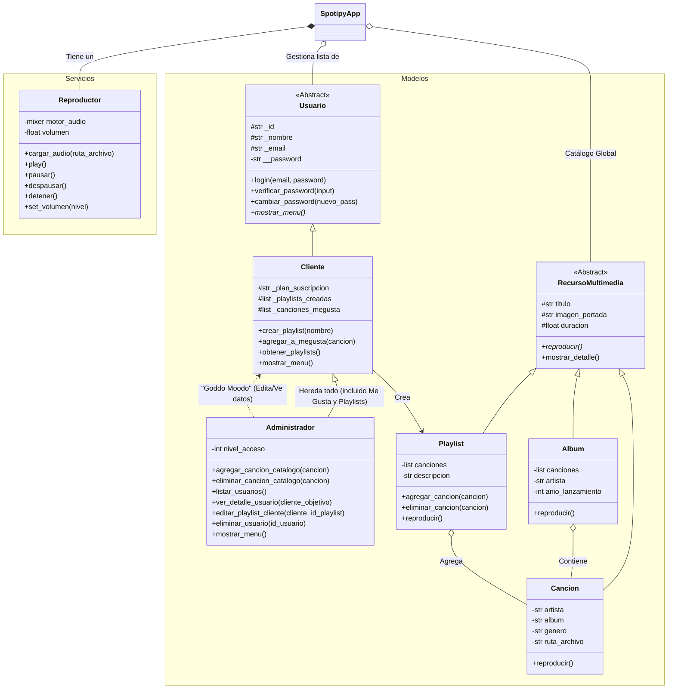

```mermaid
classDiagram
    %% --- JERARQUÍA DE USUARIOS ---
    Usuario <|-- Cliente
    Cliente <|-- Administrador : Hereda todo (incluido Me Gusta y Playlists)

    %% --- JERARQUÍA MULTIMEDIA ---
    RecursoMultimedia <|-- Cancion
    RecursoMultimedia <|-- Album
    RecursoMultimedia <|-- Playlist

    %% --- RELACIONES ---
    SpotipyApp *-- Reproductor : Tiene un
    SpotipyApp o-- Usuario : Gestiona lista de
    SpotipyApp o-- RecursoMultimedia : Catálogo Global
    
    Album o-- Cancion : Contiene
    Playlist o-- Cancion : Agrega
    Cliente --> Playlist : Crea
    Administrador ..> Cliente : "Goddo Moodo" (Edita/Ve datos)

    %% --- SERVICIOS ---
    namespace Servicios {
        class Reproductor {
            -mixer motor_audio
            -float volumen
            +cargar_audio(ruta_archivo)
            +play()
            +pausar()
            +despausar()
            +detener()
            +set_volumen(nivel)
        }
    }

    %% --- MODELOS ---
    namespace Modelos {
        class Usuario {
            <<Abstract>>
            #str _id
            #str _nombre
            #str _email
            -str __password
            +login(email, password)
            +verificar_password(input)
            +cambiar_password(nuevo_pass)
            +mostrar_menu()*
        }

        class Cliente {
            #str _plan_suscripcion
            #list _playlists_creadas
            #list _canciones_megusta
            +crear_playlist(nombre)
            +agregar_a_megusta(cancion)
            +obtener_playlists()
            +mostrar_menu()
        }

        class Administrador {
            -int nivel_acceso
            +agregar_cancion_catalogo(cancion)
            +eliminar_cancion_catalogo(cancion)
            +listar_usuarios()
            +ver_detalle_usuario(cliente_objetivo)
            +editar_playlist_cliente(cliente, id_playlist)
            +eliminar_usuario(id_usuario)
            +mostrar_menu()
        }

        class RecursoMultimedia {
            <<Abstract>>
            #str titulo
            #str imagen_portada
            #float duracion
            +reproducir()*
            +mostrar_detalle()
        }

        class Cancion {
            -str artista
            -str album
            -str genero
            -str ruta_archivo
            +reproducir()
        }

        class Album {
            -list canciones
            -str artista
            -int anio_lanzamiento
            +reproducir()
        }

        class Playlist {
            -list canciones
            -str descripcion
            +agregar_cancion(cancion)
            +eliminar_cancion(cancion)
            +reproducir()
        }
    }
```